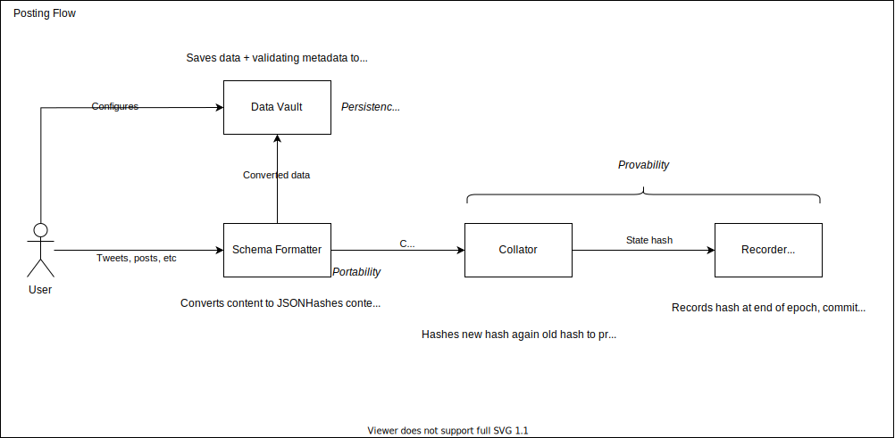
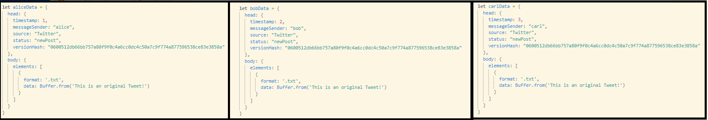

# The Age of Data Sovereignty
## Web2 Social Media, Web3 Personal Data

_TL;DR: Content is at the heart of all social media, so decentralized social media efforts must focus on **data sovereignty** rather than platform development. One key benefit of starting with data primitives is that it allows for **the application of Web3 data ownership principles to Web2 platform activity**. This piece proposes an architecture for a Portable, Persistent, Private, and Provable personal social media data management system, called Hypercube._

## Introduction
Social media is 100%, absolutely, inarguably, about user content. Platforms like Twitter, Instagram, and TikTok provide tools that _enable_ content creation, but ultimately they rely on reaching a critical mass of individual users utilizing those tools. The platforms, however, own both the interface through which content is created and the underlying data itself. They can thus be considered _vertically integrated_ with user content, using their position to extract value from the views the user activity drives and distribute it to their shareholders.

> Fundamentally, decentralized social media means that platforms will compete to host your data, as opposed to holding it hostage.

_Decentralized_ social media is poised to disrupt this monopoly by giving users complete sovereignty over their own data. Platforms, then, will primarily become interfaces through which that data is viewed. The implications of separating the data from the interfaces are numerous; most importantly, it will empower users to "just leave" for a better platform if the one they are on is not respecting their data. A high switching cost is one of the largest barriers to exiting a social media network, which data sovereignty largely eliminates. Fundamentally, decentralized social media means that platforms will compete to host your data, as opposed to holding it hostage.

Consider an example with Instagram. Imagine that Carl has developed an audience by carefully crafting a public image through his posts. Despite the fact that Instagram is monetizing his content, he has no choice but to stay because if he leaves, the fruits of his hard work is lost. On the other hand, if he owned his content data, he could simply export it and plug it into a different (for example) Instagram-like interface that promises to share advertising revenue with him.*

\* It is recognized that a significant portion of an account's value is in who follows it - audience migration will be the topic of a different post.

## State of Decentralized Social Media
Existing decentralized social media initiatives tend to take a tokenization approach that breaks social media components (posts, follows, replies, etc) into modules and issues a new NFT that represent those activities. For example, a user with one published post who follows ten other users would have 11 NFTs. However, this model poses two major problems that threaten adoption from the outset:

1. Cost/Value mismatch. Each operation must be committed on-chain, which incurs cost, which discourages content creation. Social media is a volume game, and any friction to interacting drastically decreases the odds of gaining traction. Moreover, it is quite rare for a single piece of content to have high intrinsic value. Accounts tend to accrue aggregate value after sustaining high content quality for a long period.
2. Immutability versus ownership. A post represented as an NFT is embedded forever on-chain. Every centralized social media platform gives users the option to delete posts, honoring the user's "right to be forgotten". If you own the NFT, but are unable to render its content inaccessible to the public, then that cannot be considered "ownership" in any meaningful sense. Instead of striving for data immutability, decentralized social media should strive for **data sovereignty.**

> If you own the NFT, but are unable to render its content inaccessible to the public, then that cannot be considered "ownership" in any meaningful sense.

## Mental Model for Data Sovereignty

> Instead of building an on-chain Twitter, we should first be taking ownership of our Twitter posts.

Thus far, it has been established that in the context of social media, personal data immutability is not optimal. Personal data _sovereignty_ that gives a user complete control over the presence _or_ lack thereof of their content is a much more meaningful target. The simplest mental model for defining data sovereignty is the "Four P's":

*	**Portability** - a universal, open data schema that makes content created within one context or platform easily consumable from another. But the schema must be populated by data that lives somewhere. So the next prerequisite is...
*	**Persistence** - the content in its original form is stored in such a way that it can always be accessed by its creator. The data must in turn be protected, which requires...
*	**Privacy** - by default, the creator has the right for their content to be seen _or_ unseen. Practically, this means preventing the data in its persistent form from being accessed by anyone but the creator. At this point, the data is secure and standardized. Now there needs to be a mechanism whereby other people can validate that the creator said what they said, when they said it. This key characteristic is...
*	**Provability** - the creator is able to prove the integrity of their content. This includes both 'body' data such as the image or caption of an Instagram post, and metadata such as the time the post was created.

A byproduct of using a data sovereignty-centric mindset is that it provides a framework to protect all of our data, including that which is produced in a Web2 context. Put differently, instead of building an on-chain Twitter, we should first be taking ownership of our Twitter posts.

The remainder of this piece will propose an implementation of applying the Four P's to any content that a user creates, regardless of the source.

## Portability
The first step is designing a universal data schema that is flexible enough to handle data from any social media source. While TikTok is very different from Twitter, which in turn is very different from Medium, they _do_ share commonalities. Specifically, each post has "body" data that is at most a combination of text, image, video, and/or audio files. As such, they can all be represented by the following schema:

```
body: {
  elements: [
    {
      format: string,
      data: Buffer
    }
  ]
}

```

where:
* `elements`: is an array containing the elements of the post. 
  * `format`: is the extension of the element. `.txt`, `.jpeg`, `.mp4`, `.wav`, etc.
  * `data`: is the raw data of the element. While it is tempting to store the post data at a link, it introduces a dependency on the platform host. Encoding (and storing) it as a Buffer or some other machine-readable format is the most straightforward way for a user to own the original data.

The next step is defining other identifying characteristics of the content under a general "head" tag. This is represented as:

```
head: {
  timestamp: number,
  messageSender: address,
  source: string, 
  status: string,
  versionHash: bytes32
}
```

where:
* `source`: is 'Twitter', 'Instagram', etc
* `status`: is the operation performed on the content (i.e. new post, deleted post, edited post)
* `versionHash`: identifies the software version that is parsing the post. Future versions may have updates to this base schema, so it is important to know what version was used to know what rules were applied to the data.

To put it all together, **a Twitter post that reads "Hello, world!" from connected wallet address "0x0Da1E5F74238eBB01f4a41b06D5bFb3B321E2d32" on March 16, 2022 17:53 UTC** would be:
```
data = {
  head: {
    timestamp: 1647453195729,
    messageSender: "0x0Da1E5F74238eBB01f4a41b06D5bFb3B321E2d32",
    source: "Twitter",
    status: "newPost",
    versionHash: "0600512db66bb757a80f9f0c4a6cc0dc4c50a7c9f774a877596538ce83e3858a"
  },
  body: {
    elements: [
      {
        format: ".txt",
        data: <Buffer 48 65 6c 6c 6f 20 57 6f 72 6c 64 21>
      }
    ]
  }
}
```

## Persistence & Privacy
Armed with a universal schema, the next challenge to solve is storage. As the data belongs to the user, so should the decision for how to store it. Cloud databases, IPFS, or even local machine storage should all be options. This is where the primary departure from "traditional" decentralized social media lies - the user decides on the storage method for the original data that satisfies their own censorship risk tolerance.

Personal agency over storage also introduces privacy benefits for the user. If the storage is configured to encrypt the content upon receipt, then only the original user should be capable of decrypting it. While nothing can prevent centralized social media interfaces from saving data from posts, or viewers from taking screenshots, it at least protects the original records from being publicly accessed.

Persistence and privacy address two sides of the same data sovereignty coin: the right to not be censored, and the right to be forgotten. Censorship occurs at a platform level, where a user's account or content is rendered inaccessible by being removed without their consent. Persistence solves this by storing the original content in a user-controlled vault. The right to be forgotten is a uniquely challenging issue with the blockchain, as the record is both publicly viewable and immutable. The following section will address how the blockchain can be used to prove a user's ownership over content without compromising their privacy.

## Provability
Social media is ultimately a multiplayer game. The prior three points have focused on _protecting_ an individual user's data, but a functioning social media ecosystem requires other users to be able to trust the integrity of that individuals' content.

Consider the following situation: Alice published a tweet on Twitter on February 1, 2022, predicting the price of ETH on March 1, 2022 perfectly. The veracity of her prediction is reliably verifiable on the original platform, as the timestamp is impossible to change without serious collusion with Twitter. But on March 15, 2022, her account is deleted. Fortunately, she has the original data because she was using Hypercube, and decides to move over to a more decentralized platform where she will not face the same censorship. When porting her old tweets over, how can the new social media platform verify that her prediction did indeed take place a full month before the actual price event, and isn't just a result of her tweaking the `timestamp` section of her metadata?

The simplest privacy-preserving solution would be to hash the content data and only commit that on-chain at the time it was posted, but that violates the cardinal expectation of not requiring the user to pay for each post. Instead, a mechanism inspired by rollups allows anyone to trustlessly validate an arbitrarily large quantity of posts with minimal on-chain interactions.

First, the data as described by the schema, containing information about the content body, its author, and the time it was committed, is hashed into a single 32 byte object (the **content hash**). The content hash is then sent to another system (identified as the **Collator** in the below diagram), which keeps track of a single hash representing the current state of the system (the **state hash**). The new content hash is hashed together with the old state hash, creating a new state hash that represents all submitted posts, in order of submission.

Every so often, the Collator will submit the current state hash to the blockchain. If a client-side social media application wants to verify a user's imported posts, they can run a validating function that compares the content hashes to the history of hashes that the Collator maintains, then compare that history against the on-chain checkpoints. While there are still gas fees involved, they are not on a per-post basis and can be absorbed by the entity operating the Collator. That entity can monetize in numerous ways, such as charging a subscription fee that covers the periodic gas costs in exchange for offering complete data sovereignty to the subscriber.

The diagram below illustrates how data flows in this system.




### Provability Example

Consider Alice, Bob, and Carl, all trying to post exactly the same thing. However, Alice tweets before Bob, who tweets before Carl. A representation of their parsed data is below:

;

Because the timestamps and authors are different, the hashes are completely different as well:

```
Alice: e2a34a8b32494fb98ade246118c1ba2e3f25959a687a37087f89e3421986f706
Bob: 4ec428e9c93a7dcf93f73a231bb1db1264c56361ed702de7055c192cc8d48d24
Carl: f0ca518763d2f96eb7dfbaef0eaceab1dda90a05736769efa0a0d812d0324a76
```
Which would lead to the state hash being updated as so:
```
stateHash = '0000000000000000000000000000000000000000000000000000000000000000' // base state, t=0
stateHash = keccak256(stateHash, aliceHash) // d874d9e5ad41e13e8908ab82802618272c3433171cdc3d634f3b1ad0e6742827, t=1
stateHash = keccak256(stateHash, bobHash) // 3d6f477a1caf10587cd8780ff3d3950bde7a6b3379ae6af072fa9b012843d38a, t=2
stateHash = keccak256(stateHash, carlHash) // 62e615317aa44faee95ca1ff0e63fb59a9b6b6cc74c6b471c06786e423e7fdd8, t=3
```

For Alice to prove that she was the poster at t=1 (and therefore before Bob and Carl), she only needs to know the state hash of the previous state (t=0). When she submits `aliceHash`, it will match with the recorded state hash at t=1. Bob cannot prove that he was the poster at t=1, because submitting `bobHash` at t=0 will produce a completely different result.

## What is Next?
Development and scaling.

The first Collator will be a single cloud computing instance that all traffic gets routed to. Efforts will be made to further decentralize that, perhaps even making it a purpose-built chain or subnet in a blockchain ecosystem that supports such an architecture.

Listeners (`Schema Formatter`s in the diagram above) will be required to parse content and relay it to the Collator at the time the user sends it. Likely one listener per platform per device type will be needed. For example, Twitter will need one for the web app (likely in the form of an extension), one for iOS, and one for Android.

Architecture around storage modules for different storage locations (i.e. AWS, browser storage, local file, IPFS) is needed. Must support encryption/decryption. This includes developing standards for how to connect listeners to storage destinations.

As you can see, most of this work is largely conceptual but should serve as a basecamp for thinking about data sovereignty. If you want to collaborate and help turn it into something meaningful and productized, DM me on [Twitter](https://twitter.com/brotsu).